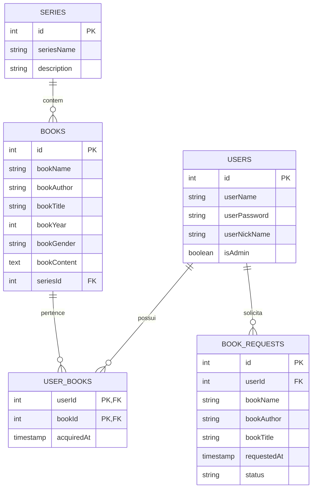

# TO-DO:
- Criar o banco de dados:
    - Criar o modelo conceitual.
    - Criar o modelo lógico.
    - Criar o modelo fisico com migrations.

## Descrição do Site:
- Página inicial com alguns livros.
- Página de login e de criação de usuário.
- Página do usuário com os livros que pertencem à ele.
- Página do livro acessada sem logar, onde aparecem apenas descrições básicas.
- Página do livro acessada logado, onde caso o usuário tenha o livro vai aparecer as descrições básicas e o conteúdo do livro, que seria o texto completo dele.
- Página das séries, por exemplo Harry Potter tem diversos livros, mas é de uma mesma série.
- Página de gerenciamento, estando logado como administrador a opção vai aparecer. Por essa página vai ser possível adcionar novos livros ao banco de dados. Remover livros e editar livros.
- Página de sugestões para usuários comuns, eles vão poder solicitar livros novos, essa solicitação vai aparecer somente para o administrador, que vai poder análisar quais livros os usuários estão mais interessados em receber de novidade.

Perfeito, entendi 😃
Você quer o **modelo conceitual** em Markdown, ou seja, um resumo **sem tipos SQL**, apenas entidades e relacionamentos.

# Ideia inicial do Banco de Dados

## Usuário (`User`)

* id
* userName
* userPassword
* userNickName
* isAdmin

**Relacionamentos**:

* Pode possuir vários **Books** (via `UserBooks`)
* Pode fazer várias **BookRequests**

---

## Série (`Series`)

* id
* seriesName
* description

**Relacionamentos**:

* Pode ter vários **Books**

---

## Livro (`Book`)

* id
* bookName
* bookAuthor
* bookTitle
* bookYear
* bookGender
* bookContent
* seriesId

**Relacionamentos**:

* Pertence a uma **Series** (opcional)
* Pode ser adquirido por vários **Users** (via `UserBooks`)

---

## Relação Usuário ↔ Livro (`UserBooks`)

* userId
* bookId
* acquiredAt

**Relacionamentos**:

* Liga **Users** e **Books** (N:N)

---

## Solicitação de Livro (`BookRequest`)

* id
* userId
* bookName
* bookAuthor
* bookTitle
* requestedAt
* status

**Relacionamentos**:

* Pertence a um **User**

---

